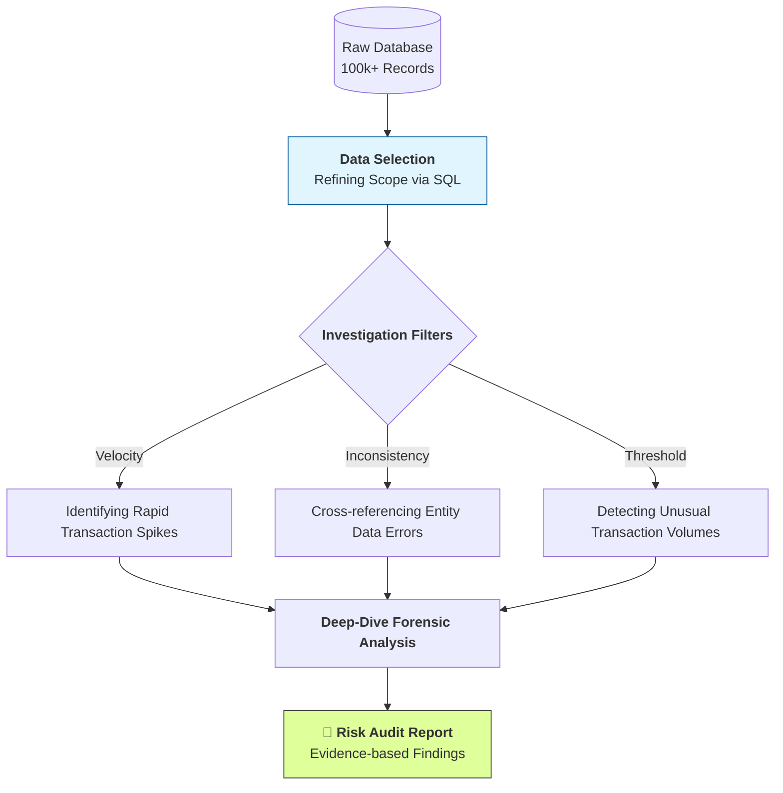

# KPMG Case Study: Spotting High-Risk Activity with SQL Data Mining

## 📌 Executive Summary
During my time at KPMG, I specialized in using **SQL analytics** to bridge the gap between raw data and actionable risk insights. By moving beyond traditional manual sampling, I performed **full-population testing on 100,000+ records** to pinpoint operational errors and systemic risks, ultimately delivering high-level audit reports for strategic decision-making.

---

## 🛠️ Data Investigation Workflow
My approach focuses on translating complex business risks into precise SQL queries to isolate high-risk anomalies.



## 💻 Technical Showcase: Identifying Anomalies
*This SQL query helps me pinpoint accounts that show suspicious behavior: high frequency, large amounts, and connections to high-risk regions.*

```sql

-- Criteria: >$100k total volume in 30 days + High-risk country + >10 transactions/week
SELECT 
    Account_ID, 
    Country_Risk_Level,
    COUNT(Transaction_ID) AS Weekly_Frequency, 
    SUM(Transaction_Amount) AS 30_Day_Total_Value
FROM Transaction_Ledger
WHERE Transaction_Date >= DATEADD(day, -30, GETDATE())
  AND Country_Risk_Level = 'High'
  AND Account_Status = 'Active'
GROUP BY Account_ID, Country_Risk_Level
HAVING COUNT(Transaction_ID) >= 10  -- Frequent activity per week
   AND SUM(Transaction_Amount) > 100000; -- High volume threshold in 30 days
