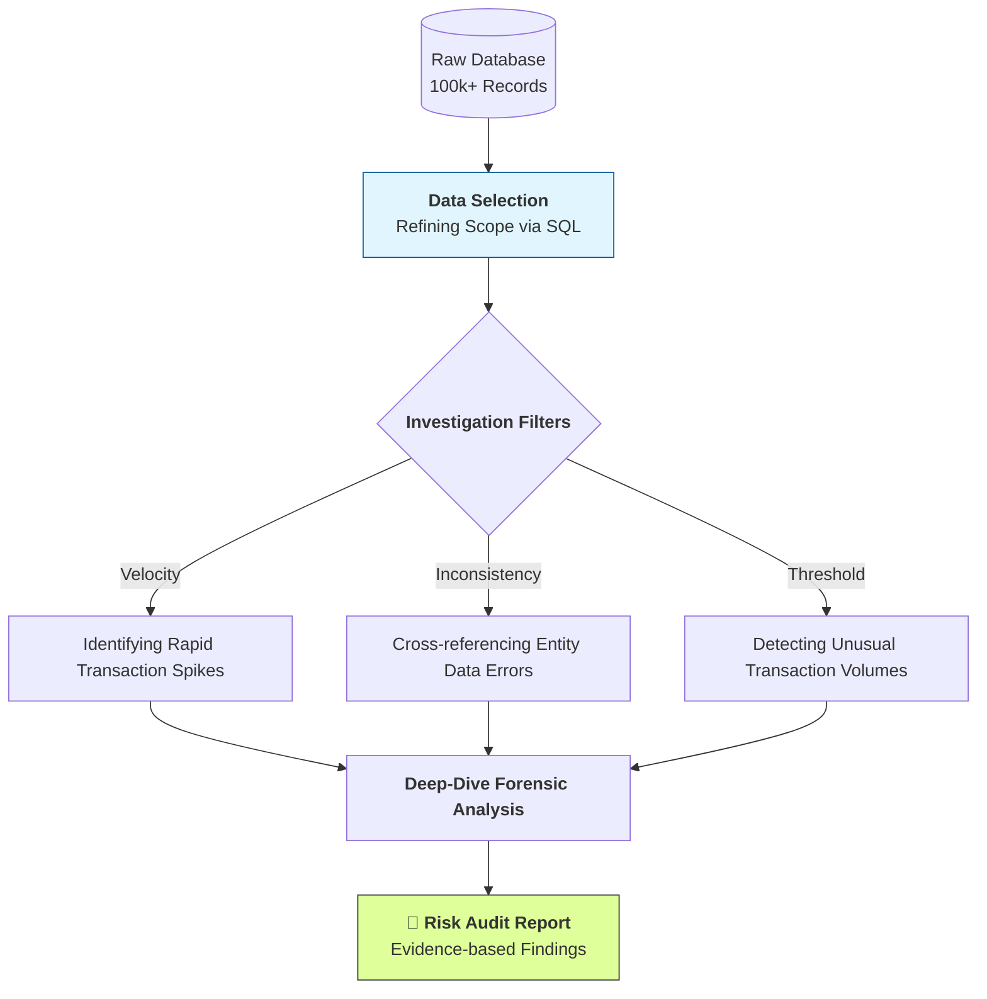

# KPMG Case Study: Risk Pattern Identification via SQL Analytics

## 📌 Executive Summary
During my time at KPMG, I specialized in using **SQL analytics** to bridge the gap between raw data and actionable risk insights. By moving beyond traditional manual sampling, I performed **full-population testing on 100,000+ records** to pinpoint operational errors and systemic risks, ultimately delivering high-level audit reports for strategic decision-making.

---

## 🛠️ Data Investigation Workflow
My approach focuses on translating complex business risks into precise SQL queries to isolate high-risk anomalies.



## 💻 Technical Showcase: Identifying Anomalies
*This sample logic demonstrates how I isolate specific risk patterns from large datasets to prepare for audit reporting.*

```sql
-- Identifying potential "Structuring" or High-Volume anomalies for the risk report
SELECT 
    Account_ID, 
    COUNT(*) AS Transaction_Count, 
    SUM(Transaction_Amount) AS Total_Value
FROM Transaction_Ledger
WHERE Status = 'Active'
GROUP BY Account_ID
HAVING COUNT(*) > 20 -- Focusing on high-frequency activity
   AND SUM(Transaction_Amount) > 50000; -- Filtering for significant operational impact
